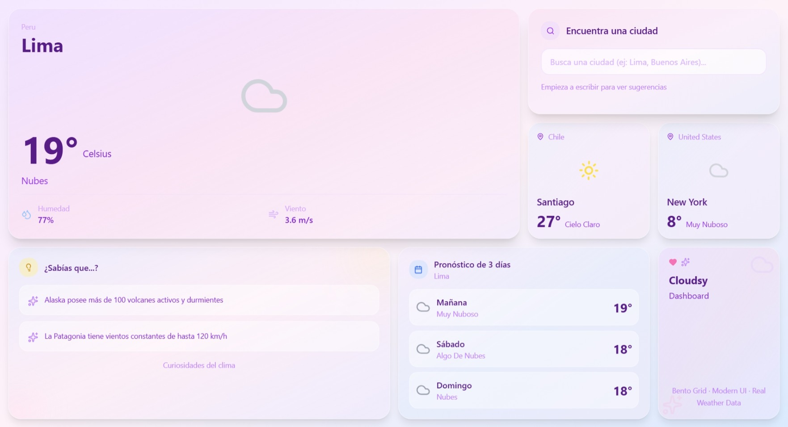

# ☁️ Cloudsy - Weather App

Aplicación del clima interactiva con diseño moderno Bento Grid, construida con React y Node.js.

## 🌟 Características
 
- 🔍 **Búsqueda inteligente** con autocompletado de ciudades
- 🌍 **Soporte global** para ciudades de todo el mundo
- 📊 **Pronóstico de 3 días** con datos detallados
- 🎨 **Diseño Bento Grid** moderno y responsive
- 🌈 **Animaciones fluidas** con Framer Motion
- 📍 **Geocoding preciso** para evitar confusiones entre ciudades con el mismo nombre
- 🎲 **Ciudades sugeridas** por continente de forma dinámica

## 🚀 Demo en Vivo

🔗 [https://cloudsy-weather.vercel.app/](https://cloudsy-weather.vercel.app/)

## 🛠️ Tecnologías Utilizadas

### Frontend
- **React** - Librería de UI
- **Tailwind CSS** - Estilos y diseño
- **Framer Motion** - Animaciones
- **Axios** - Peticiones HTTP
- **Lucide React** - Iconos

### Backend
- **Node.js** - Runtime
- **Express** - Framework web
- **Axios** - Cliente HTTP
- **CORS** - Manejo de políticas de origen cruzado

### APIs
- **OpenWeather API** - Datos del clima y geocoding

### Deployment
- **Frontend:** Vercel
- **Backend:** Render

## 🎯 Funcionalidades Principales

### Búsqueda de Ciudades
- Autocompletado con sugerencias en tiempo real
- Manejo inteligente de ciudades con nombres duplicados
- Formato: "Ciudad, Estado, País"

### Información del Clima
- Temperatura actual
- Sensación térmica
- Humedad y velocidad del viento
- Descripción del clima
- Pronóstico de 3 días

### Ciudades Sugeridas
- Selección aleatoria de 2 ciudades del mismo continente
- Se actualiza al buscar una nueva ubicación
